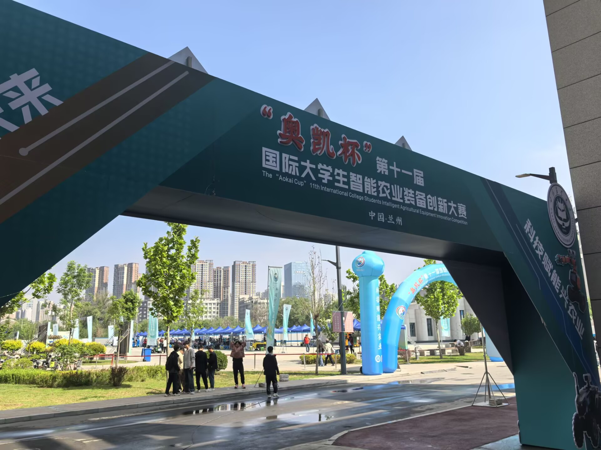
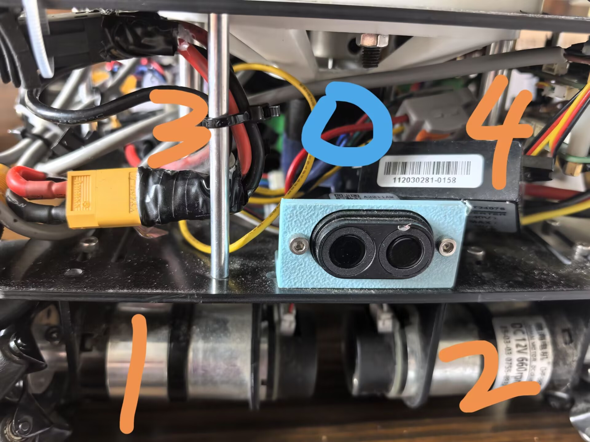

土豆捡拾机器人--国特

[全国大学生智能农业装备大赛](https://uiaec.ujs.edu.cn/news_show.php?id=224&enable_bottom_share_style=1&hybrid_event_param=HybridEventParams(enterMethod%3Dmessage_markdown_url%2C%20localPage%3Dchat%2C%20chatType%3Ddefault%2C%20duration%3D0%2C%20isRichMediaPictureLink%3Dfalse%2C%20mobMap%3D%7Bmessage_id%3D44593443849069314%2C%20previous_page%3Dlanding%2C%20is_immersive_background%3D0%2C%20chat_type%3Ddefault%2C%20reply_id%3D44593443849065474%2C%20enter_method%3Dlanding%2C%20conversation_id%3D25527779820228866%2C%20enter_chat_method%3Dlanding%2C%20bot_id%3D7234781073513644036%2C%20current_page%3Dchat%7D%2C%20extra%3Dnull)&use_xbridge3=true&loader_name=forest&need_sec_link=1&sec_link_scene=im&theme=light),B类马铃薯捡拾机器人

## 逻辑:

### 作业机构:

一个步进电机(0)驱动丝杆升降作业机构,作业机构上面两个小电机自主选旋转(固定PWM)收割
这是一个板子驱动的,和主要的F407板子通过读取IO口电平通信  

### 底盘控制:

UART+DMA读取陀螺仪角度数据(主要是YAW),这部分通过cubemx配置,然后通过位置式PID角度环输出到速度环控制车身航向
通过设置cubemx,让编码器脉冲计数到计时器的CNT寄存器中,10ms中断,然后去极值求平均估算出每个脉冲代表的车子实际位移,再除以时间就得到车身速度
然后PID速度环+麦轮正解输出4个麦轮的速度,

速度环的期望是通过车子原始速度期望+超声波测量纠正
超声波有边沿中断,发出的时候是上升沿,然后打开计时器并设置下降沿触发中断,然后接收到超声波,对应的引脚就变成低电平,触发下降沿,获取时间,再乘以声音的速度除2获取举例
超声波配合光电管判断经过了多少的垄,配合编码器算出的移动距离判断行驶了多远的路(左右两侧的光电管是后来加上的)

---

代码里本来还有OLED,但是是IIC的,增加延迟了隧去除

### 问题遗留

虽然成绩很好,但是还有可以改进的地方
作业机构有时遇到特殊的摆放可能会卡容易卡
速度期望根本没到就跑完了,底盘的电机选型稍差,速度不够

超声波延迟太大,制约车身速度
硬件电源不稳,有时会突然断电
